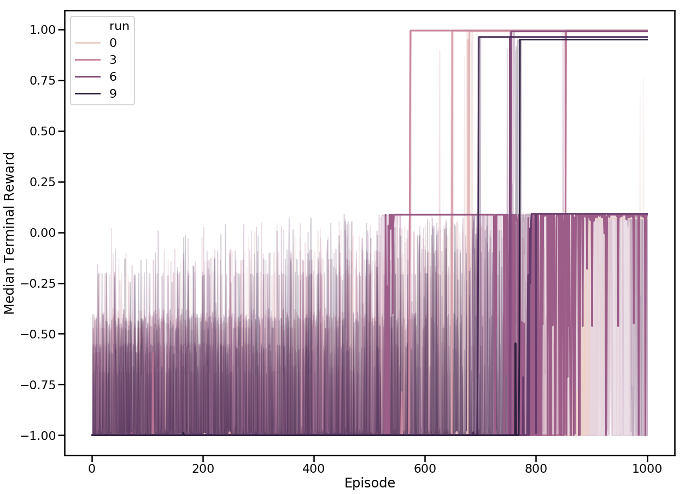

# Dinner Table scenario #

In this notebook we discuss framing the task of setting a dinner table as an instance of PUnS


```python
from SpecificationMDP import *
from LearningAgents import *
from utils_dinner_table import *
import matplotlib

%matplotlib inline

```

We begin by creating an instance of the dinner table MDP with the minimum regret formulation chosen as the reward.


```python
MDP = CreateDinnerMDP(reward_type='min_regret')
print('The number of formulas in the FSM: ', len(MDP.specification_fsm._formulas))
print('The number of unique states in the specification FSM: ', len(MDP.specification_fsm.states2id))
#EnvMDP = MDP.control_mdp
```

    @[DinnerPlate=0, SmallPlate=0, Bowl=0, Knife=0, Fork=0, Spoon=0, Mug=0, Glass=0, ]
    The number of formulas in the FSM:  25
    The number of unique states in the specification FSM:  3024


We can inspect what the probabilities of the specifications were in descending order


```python
sns.set_context('poster')
plt.figure(figsize=(20,15))
sns.barplot(x=list(range(len(MDP.specification_fsm._formulas))), 
            y = MDP.specification_fsm._partial_rewards, 
            color = '#386d1d')
```


    <matplotlib.axes._subplots.AxesSubplot at 0x7f6144e1ea20>


Suppose we had compiled the specification MDP with just the most likely specification


```python
MDP_map = CreateDinnerMDP(reward_type = 'map')
print('The number of formulas in the FSM: ', len(MDP_map.specification_fsm._formulas))
print('The number of unique states in the specification FSM: ', len(MDP_map.specification_fsm.states2id))
```

    @[DinnerPlate=0, SmallPlate=0, Bowl=0, Knife=0, Fork=0, Spoon=0, Mug=0, Glass=0, ]
    The number of formulas in the FSM:  1
    The number of unique states in the specification FSM:  193


We can also compile with the chance constrained formulation with $\delta = 0.95$.


```python
MDP_cc = CreateDinnerMDP(reward_type = 'chance_constrained', risk_level = 0.05)
print('The number of formulas in the FSM: ', len(MDP_cc.specification_fsm._formulas))
print('The number of unique states in the specification FSM: ', len(MDP_cc.specification_fsm.states2id))
```

    @[DinnerPlate=0, SmallPlate=0, Bowl=0, Knife=0, Fork=0, Spoon=0, Mug=0, Glass=0, ]
    The number of formulas in the FSM:  7
    The number of unique states in the specification FSM:  705


And now with $\delta = 0.90$.


```python
MDP_cc = CreateDinnerMDP(reward_type = 'chance_constrained', risk_level = 0.1)
print('The number of formulas in the FSM: ', len(MDP_cc.specification_fsm._formulas))
print('The number of unique states in the specification FSM: ', len(MDP_cc.specification_fsm.states2id))
```

    @[DinnerPlate=0, SmallPlate=0, Bowl=0, Knife=0, Fork=0, Spoon=0, Mug=0, Glass=0, ]
    The number of formulas in the FSM:  4
    The number of unique states in the specification FSM:  449


Notice that with the *most likely* and the *chance constrained* formulation, the number of formulas in the posterior and the number of unique specification states is a lot smaller. 

## Training Q-learning agents ##

For each learning agent, we train the agent one episode at a time. Then at each step in learning, we evaluate its performance on an agent executing the learned softmax policy (temperature parameter 0.01) for 50 test runs. The terminal reward value for each of these 50 runs is recorded. This procedure is repeated for all training runs executed. For each training run, the record of the learning curve is saved in a directory specified by the user. The data points include the statistics of the reward across the run, the number of training episodes completed before the testing run was performed and type of learning agent.

We start by training a Q-learning agent without any counterfactual Q-value updates and recording its learning curve over a period of 1000 episodes. The learning curve statistics will be stored in the folder `./Q_Agent/` that we can access later. Note that this run is for the MDP compiled with the minimum regret criterion.


```python
TrainAndTest(CFAgent, MDP, 'Q_Agent', nRuns = 10, episodes = 1000)
```

We have provided data for 10 training runs of the learning agent without doing any counterfactual updates in the accompanying directory. So you don't need to run the training and evaluations. 

Similarly we record the learning curve for the agent when performing counterfactual updates and store in it the folder `./CFAgent`. Again we have provided data for 10 training runs, so you do not need to run this. In our implementation all the counterfactual Q-function updates are done serially, however in the tabular representation they would be updating different location of the memory, thus these updates can be performed in parallel in an optimized implementation.


```python
CFAgent = lambda MDP: QLearningAgent(MDP, counterfactual_updates=True)
TrainAndTest(CFAgent, MDP, 'CFAgent', episodes = 500)
```

## Visualizing learning curves ##

### No counterfactual updates ###

First lets plot the learning curve for median terminal reward for only the Q-learning agent separated by the training runs.


```python
LCData_q_agent = ReadLCData('Q_Agent','Regular')
sns.set_context('poster')
plt.figure(figsize=(20,15))
_ = lineplot(x='Episode',y='Mean Terminal Reward',data=LCData_q_agent, hue='run' , 
             ci=10, estimator=pd.np.median)
_ = plt.ylabel('Median Terminal Reward')
```





In these plots the solid line indicates the median value across evaluation episodes for a particular run while the error patch indicates the 75th and the 25th percentiles. In this plot the median performance of the agent executing the learned policy remains poor till it encounters an episode where it successfully completes the task. After that the performance of the agent remains high. We see that the variability within a particular run after the agent learns how to perform the task is quite low. However between different training runs the variability is quite high.

Also note the discrete nature of the median value. As the terminal reward is always expressed as a sum of discrete values, the median value is restricted to quantized values. The average value of the terminal reward changes between training episodes indicating that the proportion of evaluation episodes


```python
sns.set_context('poster')
plt.figure(figsize=(20,15))
_ = sns.lineplot(x='Episode',y='Mean Terminal Reward',data=LCData_q_agent, hue='run' , ci=None)
```


Here we observe that during three of the training runs, the learning agents did not converge to a good policy even after 1000 training episodes.

### With counterfactual updates ###

First we plot the median and the upper and lower quartiles for the agent trained with counterfactual updates.


```python
LCData_cfagent = ReadLCData('CFAgent','Counterfactual')
sns.set_context('poster')
plt.figure(figsize=(20,15))
_ = lineplot(x='Episode',y='Mean Terminal Reward',data=LCData_cfagent, hue='run' , 
             ci=50, estimator=pd.np.median)
_ = plt.ylabel('Median Terminal Reward')
```


In contrast to the Q-learning agent without counterfactual updates, note that the jump in performance happens with fewer episodes and with a more consistent episode count with this learning agent. Also note the lower variability in the terminal rewards compared to the agent trained without counterfactual updates.

We can also record the mean values of the terminal rewards


```python
sns.set_context('poster')
plt.figure(figsize=(20,15))
_ = sns.lineplot(x='Episode',y='Mean Terminal Reward',data=LCData_cfagent, hue='run' , ci=None)
```


Notice the more continuous improvement in performance in the early stages of training before the jump occurs.

### Comparisons ###

Now lets plot the median performances with the upper and lower quartiles on the same chart and collapse the data along the different training runs


```python
LCData = pd.concat([LCData_q_agent, LCData_cfagent], axis = 0, ignore_index=True)
sns.set_context('poster')
plt.figure(figsize=(20,15))
_ = lineplot(x='Episode',y='Mean Terminal Reward',data=LCData, hue='Learning agent' , ci=50, estimator=pd.np.median)
_ = plt.ylabel('Median Terminal Reward')
```


And now looking at the mean terminal rewards when the training runs are accumulated


```python
sns.set_context('poster')
plt.figure(figsize=(20,15))
_ = sns.lineplot(x='Episode',y='Mean Terminal Reward',data=LCData, hue='Learning agent' , ci=None)
```


